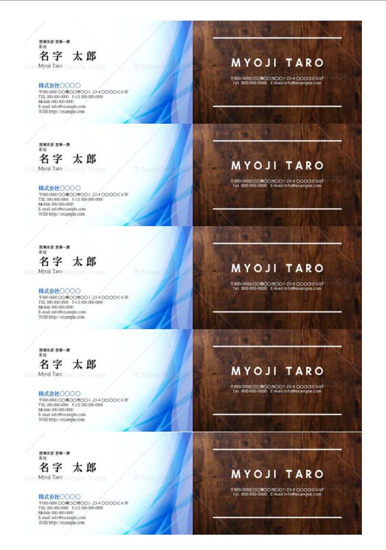

# Latexで名刺などを自分で印刷するテンプレート

名刺や身分証明証の画像をページ内に原寸大で並べて印刷するためのPDFを作るテンプレートです。

下記のように5×2で名刺大の画像を並べて印刷できます。



なお，デザインは[ここのサイト](https://design.raksul.com/products/business_card?sample_design=11059)から借りました。

## How to Use

- 必要な環境
  - Latex（pLatex）をでコンパイルできる環境。geometry.styが入っていることが必須。
  - 印刷で貼る用紙（例えば名刺なら[この用紙](https://www.amazon.co.jp/%E3%82%A8%E3%83%AC%E3%82%B3%E3%83%A0-%E3%83%9E%E3%83%AB%E3%83%81%E3%82%AB%E3%83%BC%E3%83%89-10%E9%9D%A2%C3%9725%E3%82%B7%E3%83%BC%E3%83%88-%E3%83%9E%E3%82%A4%E3%82%AF%E3%83%AD%E3%83%9F%E3%82%B7%E3%83%B3-MT-HMN2WNZ/dp/B0001I23VU/ref=sr_1_17?__mk_ja_JP=%E3%82%AB%E3%82%BF%E3%82%AB%E3%83%8A&dchild=1&keywords=%E5%90%8D%E5%88%BA%E5%8D%B0%E5%88%B7%E7%94%A8%E7%B4%99&qid=1609172719&sr=8-17)に対応）
- 準備物
  - 名刺か身分証明証の表面と裏面の画像（スケールは問わないがアスペクト比は正しくすること）
  - 本リポジトリの`BusinessCard.tex`または`IdentificationCard.tex`
- 操作手順
  - 表面の画像を`front.jpg`，裏面を`back.jpg`(pngでも可)として`imgs`フォルダに保管
  - 名刺なら`BusinessCard.tex`，身分証明証なら`IdentificationCard.tex`をコンパイル
  - 出来上がったPDFを確認！完了！

**名刺は 縦55mm×横91mm，証明証は縦53.98 mm×横85.60を想定しています。**

## サイズ調整

`BusinessCard.tex`または`IdentificationCard.tex`の違いは下記の余白決定部分のみです。
余白部分を変えることで用途に合わせた印刷が可能です。

```tex
\geometry{left=14mm,right=14mm,top=11mm,bottom=11mm}
```


### 名刺印刷

名刺印刷用のカードに余白が記載されているのでその余白に併せて下記の部分を変更する。


```tex
\geometry{left=14mm,right=14mm,top=11mm,bottom=11mm}
```


### 免許証やマイナンバーカードの印刷

下記のように理想的な余白サイズが計算できる。

- 基準となるサイズ
  - 日本のA4サイズ：縦297x横210mm
  - マイナンバーカード類のサイズ：縦53.98 mm×横85.60
- 理想的な余白サイズ： 縦 27.1x 横 38.8mm
  - 切りやすさや印刷能力を考慮して縦横に割り振る
  - 上下：13.55mm，横19.4mm
  - geometry.styがサブミリメートルに対応しているかわからないのでひとまず,上下：13mm，横19mm(余白狭め)でやると良いかと。


```tex
\geometry{left=13mm,right=13mm,top=19mm,bottom=19mm}
```
